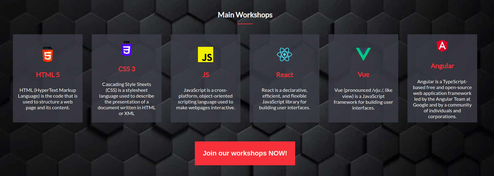
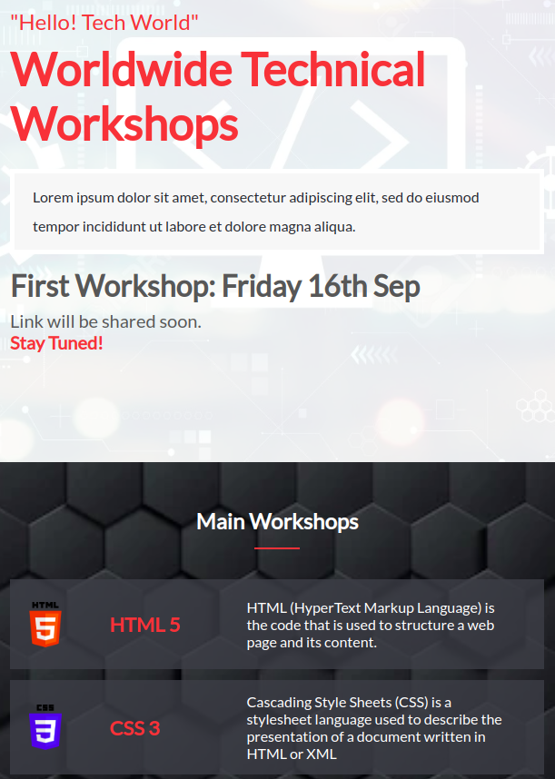

# Technical Workshops

## About

This website provides technical workshops from experienced developers worldwide. It has 2 pages; the home page and the about page. 
The home page shows all the main information about the topics and speakers. The about page shows some information about the website and the history of the workshops;

Here're are some screenshots from the mobile and desktop version from both pages;

<p align="center">
    
</p>
<p align="center">
    
</p>
<p align="center">
    
</p>
<p align="center">
    
</p>
<p align="center">
    
</p>
<p align="center">
    
</p>

## Built With

- HTML, CSS, JavaScript;
- VisualStudio Code, Git, & GitHub;


## Getting Started

1. In your terminal, in the folder of your preference, type the following bash command to clone this repository:

```sh
git clone https://github.com/MaiRizk/Technical-workshops.git
```

2. Now that you have already cloned the repo run the following commands to get the project up and running:
```sh
cd Technical workshops
```

## Live Demo (if available)

[Live Demo Link](https://mairizk.github.io/Technical-workshops/)

## Author

👤 **MaiRizk**

- GitHub: [@MaiRizk](https://github.com/MaiRizk)
- Twitter: [@MaiRizk](https://twitter.com/MaiRizk16)
- LinkedIn: [LinkedIn](https://www.linkedin.com/in/mai-rizk-252722188/)

## Acknowledgments

- The design was inspired from [Cindy Shin in Behance](https://www.behance.net/adagio07)


## 🤝 Contributing

Contributions, issues, and feature requests are welcome!

Feel free to check the [issues page](https://github.com/MaiRizk/Technical-workshops/issues).

## Show your support

Give a ⭐️ if you like this project!

## 📝 License

This project is [MIT](https://github.com/MaiRizk/Technical-workshops/blob/main/LICENSE) licensed.
